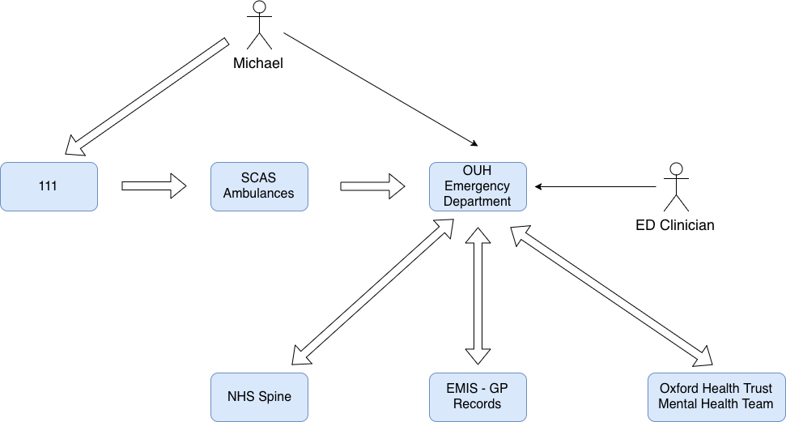

# Interopen Hackathon

Notes from the day

Main content for the day is on the Google Spreadsheet: [https://docs.google.com/spreadsheets/d/16PGLc96aRH2ipBa79GUJJ_NYKZQv5RQPksT7g8GGELU/edit?ts=5bd2d5d6#gid=0]()

## Group 3 - A&E

**Group Participants:**

* Carl Marshall - OUH
* Mark Pengelly - OUH
* Hai 
* David Milward
* Simon Knee
* Jamie Hibbard
* Nuno Almeida
* Grant Vallance - OUH (Remote)

### The Project

Looking to address the admission to A&E and then discharge to the Wards.

Section G of the Spreadsheet - *In A&E, Michael is still confused and not coherent due to the seizure. The clinicians access Michael's Medical records for his problem list, allergies, and medications. Importantly they see he is a Type 2 Diabetic requiring insulin.*

What is the problem we're trying to solve?: Problem IDs: 50-55

Two stages:

1. Can we get the records from the providers?
2. Can we get the data to our clinicians?

Additionally later stage, what do we hand off to the ward?

**Assumption**: The consuming organisation is OUH and therefore Cerner.

#### References:

**FHIR Profiles**
1. L1
   * fhir.org
   * HL7 Default: [http://hl7.org/fhir/]()
2. L2 - UK FHIR Profile: [https://fhir.hl7.org.uk]()
   * things may be taken out
   * add extensions, e.g. NHSNumberStatusCode, SNOMEDDescriptionID
3.  L3 - [fhir.nhs.uk]()
   * Compositions
   * Allow for higher-level conformances

Patient Record found by:

* Locate the patient by their NHS number on the reference system...
* Care Connect Ref Implementation: [https://data.developer.nhs.uk/ccri-fhir/STU3/Patient?identifier=9658218873]()
  * Returns a Patient ID (1183) which then unlocks the following...
* HiE Record: [https://data.developer.nhs.uk/ccri/ed/patient/1183/observation]()
* Medications: [https://data.developer.nhs.uk/ccri-fhir/STU3/MedicationStatement?patient=1183]()

#### Project Aims

**Big Picture** - Data should flow into the ED before the patient arrives at the doors. 111 and SCAS (ambulances) should share their data with OUH, which can then send out queries to other likely locations for data on this patient. The results of which can be shown within the PowerChart for the patient on arrival.

**The Dream** - We want the act of 111 calling an ambulance to trigger the pre-population of the ED encounter record for the ED Clinicians before the patient arrives, allowing them to both familiarise themselves with the incoming (and triage more effectively), and save them vital time on record keeping by picking from existing data alongside their own observations.

The technical path is something like:

1. Patient calls 111 reporting their problems. 111 create their own record about the patient, perhaps using available data sources for background. 
2. 111 refers the patient to ED, and orders and Ambulance to transport them
3. The Ambulance Service despatches the crew, supplying them with the data from 111, and alerting the ED of the incoming patient.
4. That alert triggers a process at the ED that firstly gets the patient details from service X
   * What about non-UK Patients?
5. The process then continues to query 111, and the Ambulance service for encounter details as they occur, and then widens the search to include Primary Care and other sources for further clinically relevant information
6. This data is collated and stored in the ED EPR, where the ED clinician is able to review all the evidence
7. After/during examination, these foreign records can then be easily selected and validated for inclusion in the latest ED encounter record for their EPR
8. This data can then be finalised during discharge, and exposed to the next service (Ward in this example) to care for Michael

For the A&E Clerking activity, we want a streamlined process, that allows for data to be reviewed, and easily amended/accepted. Marcus Bow's concept of [Medical Markdown](https://github.com/open-health-hub/medical-markdown) is an appealing approach to dynamic documentation (though some vendors may have a similar concept). 

##### Clerking Protocol

* **Pc** - Presenting Complaint. One or two words describing the problem. Ideally will come from 111 data
* **HPc** - History of Presenting Complaint. Longer textual description about events leading to the Pc. Ideally can be captured from 111 data.
* **PMH** - Past Medical History. A list of medical encounters with complaints and outcomes. Ideally can come from the Primary Care / GP records.
* **DH** - Drug History. Medications past and present, with dosage and patterns. Ideally from existing data and GP records. Massive time-saver on data entry if this can be quickly validated over being captured from nothing.
* **Allergies** - name on the tin.
* **On Examination** - a descriptive record, laced with items that ought to be codified data, like Pulse, Blood Pressure, Temperature, Weight, etc
* **Tests** - results from labs, etc
* **Diagnosis** - Pick your code
* **Care Plan** - And state your orders